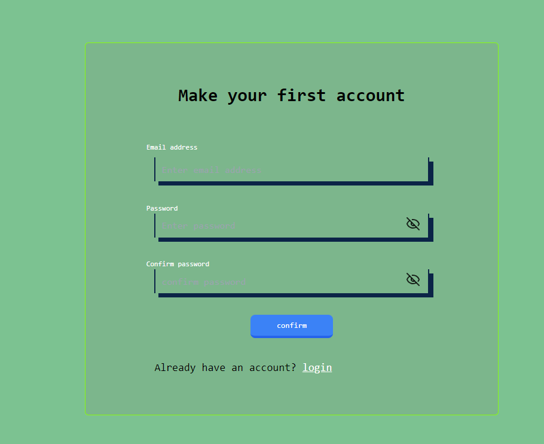
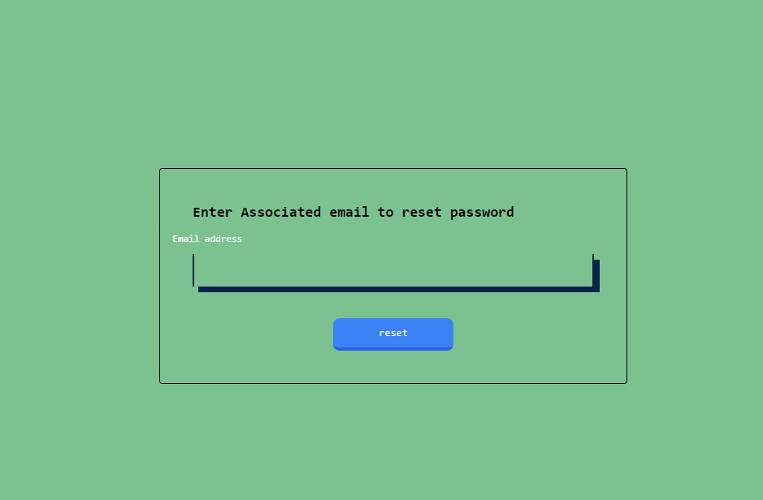

# Anime Watchlist Tracker

A clean and professional anime tracking application built with React and TypeScript. Track your favorite anime, manage your watchlist, and monitor your viewing progress

## Features

- Add, edit, and organize anime in your personal watchlist
- Keep track of episodes watched and completion percentage
- Mark your favorite anime for quick access
- Create accounts and personalize your watchlist
- User login and account creation with password recovery
- Beautiful UI that works on desktop, tablet, and mobile
- Clean, modern interface with intuitive navigation

## Tech Stack

- **Frontend Framework**: React 18+ with TypeScript
- **Styling**: Tailwind CSS + Custom CSS
- **Build Tool**: Vite
- **Icons**: Lucide React, React Icons
- **Package Manager**: npm
- **Development**: ESLint configuration

## Installation

1. **Clone the repository** 
   ```bash
   cd Watchlist-tracker
   ```

2. **Install dependencies**
   ```bash
   npm install
   ```

3. **Start the development server**
   ```bash
   npm run dev
   ```

4. **Open in browser**
   - Navigate to `http://localhost:5173` (or the port shown in terminal)

## Usage

### Getting Started
1. Create a new account or log in
2. Navigate to Dashboard to see your watchlist overview
3. Use "My List" to add new anime to your watchlist
4. Track your progress as you watch
5. Mark favorites for your top anime

### Main Pages

- **Dashboard** - Overview of your watchlist with statistics
- **My List** - Complete list of all anime you're tracking
- **Profile** - View and edit your profile information
- **Settings** - Customize your preferences
- **Contact Me** - Get in touch with us
- **Inbox** - View messages and notifications

## Screenshots

### Dashboard


### My List


### Add New Anime


### Login


### Create Account


### Reset Password


## Project Structure

```
src/
├── components/       # Reusable UI components
├── Pages/           # Page components
├── Routes/          # Routing configuration
├── styles/          # CSS files
├── utils/           # Helper functions and context
└── main.tsx         # Application entry point
```

## Development

### Available Scripts

- `npm run dev` - Start development server
- `npm run build` - Build for production
- `npm run lint` - Run ESLint
- `npm run preview` - Preview production build

## License

This project is open source and available under the MIT License.

## Contributing

Feel free to fork this project and submit pull requests for any improvements.


